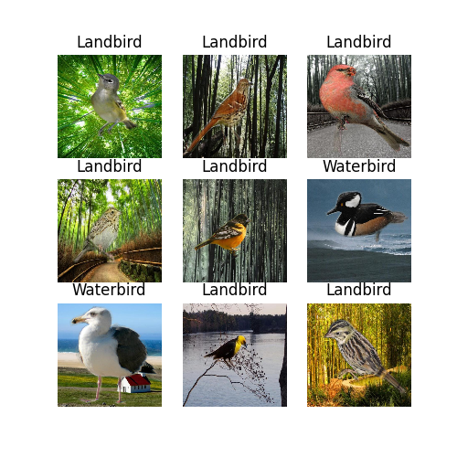

## resnet50_representation

|   |Accuracy|WGA|
| --- | --- | --- |
| **Standard** | 86.3/84.41 | 63.71/63.55 |
| **JTT** | 85.31 | 68.54 |
| **AFR** | 84.33 | 70.86 |

## regnet_representation

| |Accuracy|WGA|
| --- | --- | --- |
| **Standard** |   |   |
| **JTT** |   |   |
| **AFR** |   |   |

## dino_v2_representation

| |Accuracy|WGA|
| --- | --- | --- |
| **Standard** |   |   |
| **JTT** |   |   |
| **AFR** |   |   |